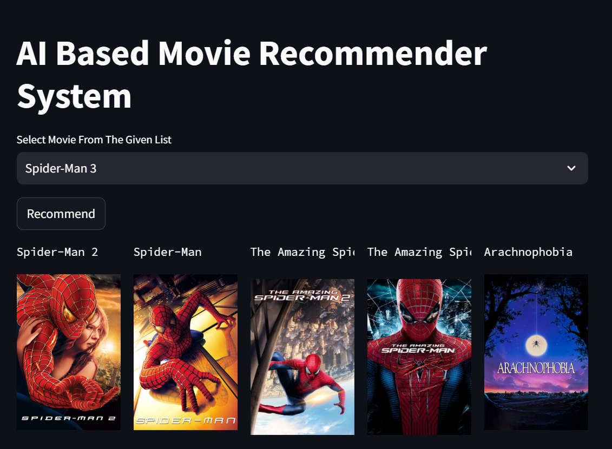

# [Movie Recommendation System](https://movierecommendationsystem-xe6tddaqlerxgfcnxruzyj.streamlit.app/)

## About Project

1. Developed an end-to-end content-based movie recommender system using a Kaggle dataset of 5000 movies.

2. Conducted extensive data preprocessing and feature engineering, creating tags for each movie and transforming them into vectors using the Bag of Words techniques.
 
3. Leveraged cosine similarity to measure the likeness between movies and recommend the top 5 movies.

4. Used libraries such as NumPy, Pandas, Scikit-Learn, NLTK, and Streamlit to streamline the recommender system's functionality and user interface. 

## App View

](https://movierecommendationsystem-xe6tddaqlerxgfcnxruzyj.streamlit.app/)

